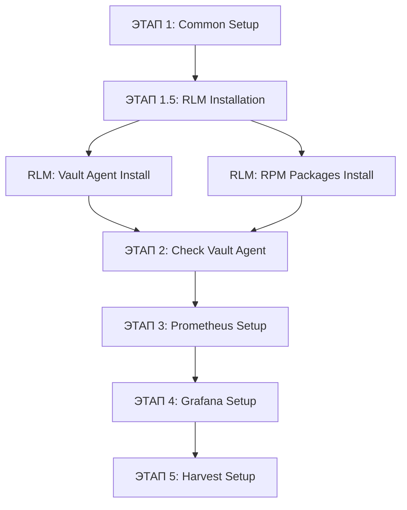

# Изменения: Исправление архитектуры Vault Agent

**Дата:** 2025-11-24  
**Версия:** 2.0  
**Статус:** Готово к развертыванию

---

## 🎯 Проблема

Pipeline падал с ошибкой:
```
TASK [Vault | Запуск Vault Agent] **********************************************
fatal: [tvlds-mvp001939.cloud.delta.sbrf.ru]: FAILED! =>
msg: |-
Unable to start service vault-agent-monitoring: Job for vault-agent-monitoring.service 
failed because the control process exited with error code.
```

**Причина:**
Ansible пытался запустить Vault Agent:
- ❌ От пользователя `CI10742292-lnx-mon_sys` (НЕ существует для Vault Agent)
- ❌ Без предварительной установки через RLM
- ❌ Как User Systemd service (должен быть System service)

---

## ✅ Решение

### Ключевое изменение архитектуры:

**Vault Agent** и **Monitoring Stack** используют **разные пользователи**:

| Компонент | User | Group | Создается |
|-----------|------|-------|-----------|
| **Vault Agent** | `{{ kae_stend }}-lnx-va-start` | `{{ kae_stend }}-lnx-va-read` | RLM сценарий |
| **Monitoring** | `{{ kae_stend }}-lnx-mon_sys` | `{{ kae_stend }}-lnx-mon_sys` | IDM (заранее) |

**Пример для `kae_stend = CI10742292`:**
- Vault Agent: `CI10742292-lnx-va-start` / `CI10742292-lnx-va-read`
- Monitoring: `CI10742292-lnx-mon_sys`

---

## 📝 Список изменений

### 1. `ansible/inventories/group_vars/all.yml`

**Добавлено:**

```yaml
# ==============================================================================
# VAULT AGENT ПОЛЬЗОВАТЕЛИ (создаются RLM сценарием)
# ==============================================================================
vault_agent_user: "{{ kae_stend }}-lnx-va-start"
vault_agent_group: "{{ kae_stend }}-lnx-va-read"

# ==============================================================================
# RLM API ПАРАМЕТРЫ
# ==============================================================================
rlm_api_url: "https://rlm.delta.sbrf.ru"

# URL для скачивания RPM пакетов через RLM
prometheus_rpm_url: "http://artifactory.sigma.sbrf.ru/artifactory/maven-public/prometheus/prometheus-latest.rpm"
grafana_rpm_url: "http://artifactory.sigma.sbrf.ru/artifactory/maven-public/grafana/grafana-latest.rpm"
harvest_rpm_url: "http://artifactory.sigma.sbrf.ru/artifactory/maven-public/harvest/harvest-latest.rpm"
```

---

### 2. `ansible/playbooks/deploy_monitoring.yml`

#### Добавлен новый ЭТАП 1.5:

**Play:** `ЭТАП 1.5: Установка ПО через RLM API`

**Что делается:**
1. **Установка Vault Agent через RLM сценарий `vault_agent_config`**
   - Создание пользователей `{{ kae_stend }}-lnx-va-start` / `{{ kae_stend }}-lnx-va-read`
   - Установка Vault Agent binary
   - Создание systemd service `/etc/systemd/system/vault-agent.service`
   - Настройка конфигурации в `/opt/vault/conf/`

2. **Установка RPM пакетов через RLM сценарий `LINUX_RPM_INSTALLER`**
   - Prometheus
   - Grafana
   - Harvest

**Важно:**
- Выполняется на Jenkins (`connection: local`)
- Использует RLM API для создания заявок
- Мониторит статус заявок до завершения (`retries: 120`)

#### Изменен ЭТАП 2:

**Старая версия:**
```yaml
- name: "ЭТАП 2: Настройка Vault Agent для управления секретами"
  tasks:
    - name: "Vault | Запуск Vault Agent"  # ❌ Пытался запустить
      systemd:
        name: vault-agent-monitoring
        state: started
```

**Новая версия:**
```yaml
- name: "ЭТАП 2: Проверка Vault Agent и получение секретов"
  tasks:
    - name: "Vault | Проверка что Vault Agent service запущен"  # ✅ Только проверка
      systemd:
        name: vault-agent
        state: started
      check_mode: yes
      
    - name: "Vault | Ожидание получения сертификатов"
      wait_for:
        path: "/opt/vault/certs/server_bundle.pem"
        timeout: 300
```

**Изменения:**
- ✅ Убран запуск Vault Agent (уже запущен через RLM)
- ✅ Убрано создание конфигурации (уже создана через RLM)
- ✅ Добавлена проверка статуса service
- ✅ Добавлено ожидание сертификатов

---

### 3. `Jenkinsfile`

**Изменено:** Передача дополнительных переменных в Ansible

```groovy
ansible-playbook \
    -i inventories/dynamic_inventory \
    playbooks/deploy_monitoring.yml \
    --extra-vars "rlm_token=${RLM_TOKEN}" \
    --extra-vars "rlm_api_url=https://rlm.delta.sbrf.ru" \       # НОВОЕ
    --extra-vars "vault_addr=https://vault.sigma.sbrf.ru" \      # НОВОЕ
    --extra-vars "vault_namespace=${env.NAMESPACE_CI}" \         # НОВОЕ
    --extra-vars "ansible_user=${SSH_USER}" \
    --private-key=${SSH_KEY} \
    ${params.DEBUG ? '-vvv' : '-v'}
```

---

### 4. Новые файлы документации

#### `VAULT_AGENT_ARCHITECTURE.md`
Полное описание архитектуры:
- Матрица пользователей (Vault Agent vs Monitoring)
- Последовательность развертывания по этапам
- Матрица доступа к файлам и systemd services
- Диагностика и troubleshooting
- Соответствие `CORPORATE_SECURITY_RULES.md`

#### `CHANGES_VAULT_AGENT_FIX.md` (этот файл)
Краткое описание изменений и миграции.

---

## 🔄 Последовательность развертывания (новая)



### Детали ЭТАП 1.5:

**RLM Vault Agent Install:**
1. API Call → RLM сервис `vault_agent_config`
2. RLM создает заявку в IDM на пользователей
3. IDM одобряет и создает `{{ kae_stend }}-lnx-va-start`
4. RLM устанавливает Vault Agent binary
5. RLM создает systemd service
6. RLM запускает service
7. **Результат:** Vault Agent работает, получает сертификаты

**RLM RPM Packages Install:**
1. API Call → RLM сервис `LINUX_RPM_INSTALLER` (3 раза)
2. RLM скачивает RPM из Artifactory
3. RLM устанавливает RPM на целевом сервере
4. **Результат:** Binaries Prometheus/Grafana/Harvest установлены

---

## 🔒 Безопасность

### Соответствие CORPORATE_SECURITY_RULES.md:

| Правило | Статус |
|---------|--------|
| Установка ПО только через ДИ/RLM | ✅ Vault Agent и RPM через RLM API |
| Пользователи создаются через IDM | ✅ RLM → IDM для Vault Agent<br>✅ Вручную через IDM для Monitoring |
| Динамические имена `{{ kae_stend }}-*` | ✅ Реализовано для обоих типов пользователей |
| Разделение полномочий | ✅ Vault Agent ≠ Monitoring |
| Автоматизация | ✅ Полная автоматизация через API |

### Матрица пользователей:

```
┌─────────────────────────────────────────────────────────────┐
│                      kae_stend = CI10742292                 │
├─────────────────────────────────────────────────────────────┤
│                                                             │
│  Vault Agent (RLM)           Monitoring (IDM)              │
│  ├─ CI10742292-lnx-va-start  ├─ CI10742292-lnx-mon_sys ◄── Group
│  └─ CI10742292-lnx-va-read   ├─ CI10742292-lnx-mon_ci      │
│                               ├─ CI10742292-lnx-mon_admin   │
│                               └─ CI10742292-lnx-mon_ro      │
│                                                             │
│  System Service              User Services                  │
│  /etc/systemd/system/        ~/.config/systemd/user/       │
│  └─ vault-agent.service      ├─ prometheus.service         │
│                               ├─ grafana.service            │
│                               └─ harvest.service            │
└─────────────────────────────────────────────────────────────┘
```

---

## 🧪 Тестирование

### Проверка после развертывания:

```bash
# 1. Проверка пользователей Vault Agent
getent passwd CI10742292-lnx-va-start
getent group CI10742292-lnx-va-read

# 2. Проверка пользователей Monitoring
getent passwd CI10742292-lnx-mon_sys
getent group CI10742292-lnx-mon_sys

# 3. Проверка Vault Agent (System service)
sudo systemctl status vault-agent
sudo journalctl -u vault-agent -n 50

# 4. Проверка сертификатов
ls -lh /opt/vault/certs/

# 5. Проверка Monitoring services (User services)
sudo -i -u CI10742292-lnx-mon_sys
systemctl --user status prometheus
systemctl --user status grafana
systemctl --user status harvest
```

---

## 📊 Сравнение: ДО и ПОСЛЕ

### ДО (неправильно):

```yaml
- name: "Vault | Запуск Vault Agent"
  systemd:
    name: vault-agent-monitoring
    state: started
    scope: user  # ❌ User service
  become_user: "{{ monitoring_service_user }}"  # ❌ Не тот пользователь
```

**Проблемы:**
- ❌ Vault Agent не установлен
- ❌ Пользователь `CI10742292-lnx-mon_sys` не может управлять Vault Agent
- ❌ User Systemd не подходит для Vault Agent

### ПОСЛЕ (правильно):

```yaml
# ЭТАП 1.5: RLM устанавливает Vault Agent
- name: "RLM | Установка Vault Agent"
  uri:
    url: "{{ rlm_api_url }}/api/tasks.json"
    body:
      service: "vault_agent_config"
      params:
        serv_user: "{{ kae_stend }}-lnx-va-start"  # ✅ Создаст через IDM

# ЭТАП 2: Только проверка
- name: "Vault | Проверка Vault Agent"
  systemd:
    name: vault-agent  # ✅ System service
    state: started
  check_mode: yes  # ✅ Только проверка, не запуск
  become_user: root  # ✅ Root может проверять System services
```

**Преимущества:**
- ✅ Vault Agent установлен правильно через RLM
- ✅ Пользователи созданы через IDM
- ✅ System Systemd service (работает до логина)
- ✅ Ansible только проверяет, не вмешивается

---

## 🚀 Миграция

### Если у вас уже был развернут Monitoring:

1. **Удалить старый Vault Agent (если был установлен вручную):**
   ```bash
   sudo systemctl --user stop vault-agent-monitoring
   sudo systemctl --user disable vault-agent-monitoring
   rm ~/.config/systemd/user/vault-agent-monitoring.service
   ```

2. **Очистить старые конфигурации:**
   ```bash
   sudo rm -rf /opt/vault/conf/agent.hcl
   ```

3. **Запустить новый Pipeline:**
   - Jenkins автоматически установит Vault Agent через RLM
   - Будут созданы пользователи `{{ kae_stend }}-lnx-va-start/read`
   - Vault Agent запустится как System service

---

## 📚 Связанные документы

- `VAULT_AGENT_ARCHITECTURE.md` — полная архитектура
- `CORPORATE_SECURITY_RULES.md` — правила безопасности
- `DYNAMIC_GROUP_SUMMARY.md` — архитектура единой группы
- `deploy_monitoring.sh` — оригинальный скрипт (референс)

---

## ✅ Чеклист готовности

Перед запуском нового Pipeline проверьте:

- [ ] Пользователи Monitoring созданы через IDM:
  - [ ] `{{ kae_stend }}-lnx-mon_sys` (СУЗ)
  - [ ] `{{ kae_stend }}-lnx-mon_ci` (ТУЗ)
  - [ ] `{{ kae_stend }}-lnx-mon_admin` (ПУЗ)
  - [ ] `{{ kae_stend }}-lnx-mon_ro` (ReadOnly)
- [ ] Jenkins Credentials настроены:
  - [ ] `rlm-token` — токен для RLM API
  - [ ] `ssh-key-mvp-dev` — SSH ключ для `mvp_dev`
  - [ ] `vault-approle-monitoring` — Vault AppRole credentials
- [ ] `NAMESPACE_CI` параметр заполнен (например: `KPRJ_01_01_000000_01`)
- [ ] `KAE_STEND` извлекается автоматически (например: `CI10742292`)

---

**Статус:** ✅ Готово к развертыванию  
**Следующий шаг:** Запуск Jenkins Pipeline с параметром `DEBUG=true`

